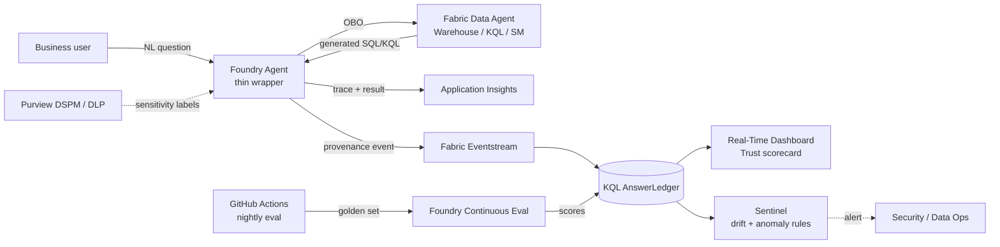

# TrustedAnswer — Provenance & Continuous Evaluation for Fabric Data Agents

> **One-page problem brief** · Microsoft stack · 2–4 week prototype

## The problem
Fabric Data Agents let business users ask natural-language questions over Warehouses, KQL DBs, and semantic models. In production, **trust collapses on three failure modes**:

1. **No provenance.** The exact SQL/KQL the agent generated, the source rows, and the sensitivity labels are not captured with the answer — answers cannot be reproduced or audited.
2. **Silent quality drift.** Schemas, prompts, and models change; nobody sees groundedness or intent-resolution degrade until a stakeholder complains.
3. **Governance gaps in preview.** Purview DSPM, Insider Risk, and DLP for Fabric data agents are in preview and not enabled in most tenants; cross-geo processing on `mcp.ai.azure.com` adds residency concerns for regulated industries.

Microsoft's own *Fabric Adoption Roadmap* lists "lack of trust in the data" as the #1 governance blocker — **agents amplify it 10×** because non-technical users now ask the questions directly.

## Who feels the pain
| Persona | Pain |
|---|---|
| **CTO / Data leader** | "Is this number right?" escalations; can't certify agent answers for board / regulator |
| **Data platform team** | No regression signal when a Warehouse schema changes; no golden-question harness |
| **CISO / Compliance** | No audit-grade ledger linking *user → prompt → generated query → rows touched → sensitivity label* |

## What we build (demo scope)
A **Fabric + Foundry + Sentinel** pattern with three pillars:

1. **AnswerLedger** — every data-agent invocation streams `{user, prompt, generated_query, source_tables, sensitivity_labels, row_count, latency, cost, eval_scores}` into an Eventstream → KQL ledger table.
2. **Continuous evaluation pipeline** — golden-question set auto-generated from production traces; nightly Foundry continuous evaluation (groundedness, intent-resolution, tool-call accuracy, retrieval F1) via GitHub Actions; drift alarm when answer for a canonical question diverges from baseline.
3. **Trust dashboard** — Real-Time KQL dashboard: per-domain trust score, top hallucinated joins, sensitivity-label hit rate, schema-drift events.

## Reference architecture

## 2–4 week build plan

| Week | Milestone | Deliverable |
|---|---|---|
| **1** | **Plumbing** | Foundry project + Fabric workspace + OBO wiring; thin Foundry agent that proxies one Fabric Data Agent and emits an OTel span + Eventstream provenance event. Healthcare or Insurance dataset from this repo as substrate. |
| **2** | **Ledger + dashboard** | KQL `AnswerLedger` table, ingestion from Eventstream, Real-Time Dashboard v1 (volume, latency, cost, sensitivity-hit rate). Purview sensitivity-label join (manual if DSPM not enabled). |
| **3** | **Continuous eval** | Golden question set extracted from `data_agent_queries/`; Foundry continuous eval wired via GitHub Action; nightly eval scores written back to ledger; per-domain trust score tile on dashboard. |
| **4** | **Drift + governance demo** | Sentinel analytic rule for answer-drift and anomalous sensitivity-label access; recorded demo: schema change → drift alarm → root-cause via ledger; 1-page CISO-facing audit story; talk track. |

## Talking points for the forum
- **CTO angle:** turns the "is this number right?" conversation into an SLA with measurable trust scores.
- **Practitioner angle:** first end-to-end working pattern for data-agent regression testing on the Microsoft stack.
- **CISO angle:** an auditable, query-level ledger — the artifact regulators will ask for.

## What's in this repo we can reuse
- `datasets/` (10 industries) — substrate for golden questions.
- `data_agent_queries/*_Example_Queries.md` — seed for golden set.
- `fabriciq-nurse-doc-burden-usecase/` — KQL dashboard pattern + Eventstream config to clone.
