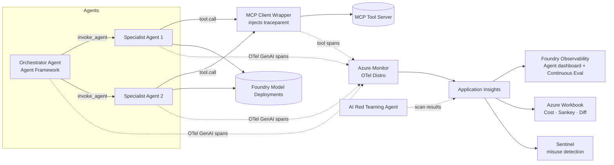

# AgentOps Black Box — Unified OpenTelemetry for Multi-Agent + MCP

> **One-page problem brief** · Microsoft stack · 2–4 week prototype

## The problem
Multi-agent systems are *notoriously* hard to operate: dynamic tool chains, latent reasoning, agent-to-agent handoffs, and MCP tool calls that today are effectively invisible to ops. Telemetry is fragmented across **Foundry agent traces, Copilot Studio diagnostics, Microsoft Agent Framework spans, Semantic Kernel, and raw MCP servers** — each in different stores, with inconsistent schemas. When an agent gives a wrong answer, leaks data, or spends $40 on one conversation, on-call cannot answer in under an hour:

> *Which agent, which tool, which prompt, which model, on whose behalf, costing how much?*

Microsoft (with Cisco/Outshift) is extending the **OpenTelemetry GenAI semantic conventions** for multi-agent (`execute_task`, `invoke_agent`, `agent_to_agent_interaction`, `agent.state.management`, `agent_planning`, `tool.call.arguments/results`). But no reference implementation stitches it all together with MCP tool spans propagated through W3C Trace Context.

## Who feels the pain
| Persona | Pain |
|---|---|
| **CTO / FinOps** | Cost-per-conversation is unknowable; can't compare model A vs model B; no regression diff between agent versions |
| **Platform / SRE** | Mean-time-to-debug is hours; no Sankey of agent handoffs; cannot tell tool-failure from model-failure |
| **CISO** | Cannot see tool-call arguments correlated to identity; prompt-injection / data-exfil signals are invisible |

## What we build (demo scope)
A reference "single-pane" implementation entirely on Microsoft stack:

1. **Demo multi-agent app** on **Microsoft Agent Framework**: orchestrator + 2 specialist agents + 1 MCP tool server.
2. **Full OTel GenAI instrumentation** following the new multi-agent conventions, exported to **one Application Insights** workspace + connected to a **Foundry project** for the unified agent dashboard.
3. **MCP trace propagation**: a thin MCP client wrapper that injects W3C `traceparent` so MCP tool calls appear as child spans of `invoke_agent` — closing today's blind spot.
4. **Workbook + KQL queries**: cost-per-conversation, tool-call success matrix, agent-handoff Sankey, prompt search, version-diff regression view.
5. **Security overlay**: **AI Red Teaming Agent** scan results overlaid on the same traces; a Sentinel rule flagging anomalous tool-call patterns.

## Reference architecture

## 2–4 week build plan

| Week | Milestone | Deliverable |
|---|---|---|
| **1** | **Skeleton agents + OTel** | 3-agent Agent Framework app; Azure Monitor OTel Distro wired; spans flowing to App Insights with `invoke_agent` / `execute_task` attributes; Foundry project connected to App Insights. |
| **2** | **MCP propagation** | Build/borrow an MCP server (e.g., Fabric Data Agent or KQL tool); wrap MCP client to inject `traceparent`; verify tool calls appear as child spans with `tool.call.arguments` / `tool.call.results`. |
| **3** | **Workbook + cost** | Azure Workbook with: cost-per-conversation (model usage spans), agent-handoff Sankey, tool-call success matrix, version-diff regression view; KQL query pack published. |
| **4** | **Security + demo** | Run AI Red Teaming Agent against the app; overlay findings on traces; Sentinel analytic rule for anomalous tool-call patterns; recorded demo + talk track; open-source the instrumentation library. |

## Talking points for the forum
- **CTO angle:** turn agent cost from "mystery line item" into a per-conversation FinOps view; vendor-neutral (replaces paid Elastic/Arize stories with native Azure).
- **Practitioner angle:** debug time hours → minutes; first public reference for MCP trace propagation on Azure.
- **CISO angle:** every tool call has identity + arguments + red-team signal in one workspace.

## Key references
- OTel GenAI semantic conventions extension (MSFT + Outshift/Cisco).
- Microsoft Foundry agent tracing + continuous evaluation.
- Application Insights "agent details" view + Foundry Observability.
- AI Red Teaming Agent + Microsoft Sentinel.
