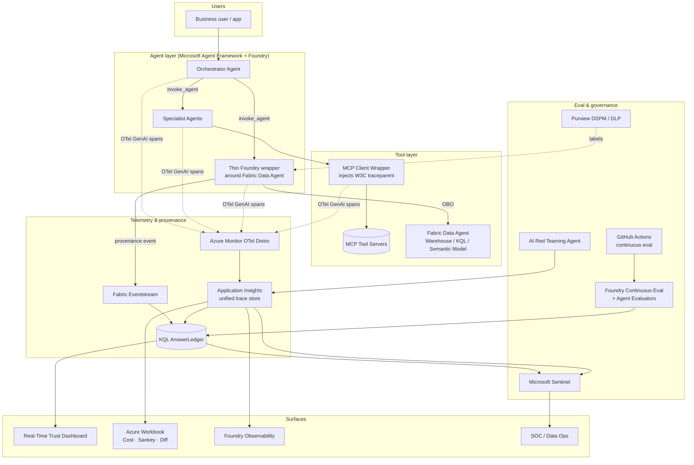

# 🚩 FLAGSHIP — **TrustedAgentOps**
### Provenance, Evaluation & Observability for Agentic Data Systems on Microsoft Fabric + Foundry

> A combined flagship project unifying *TrustedAnswer* (provenance + continuous eval for Fabric Data Agents) and *AgentOps Black Box* (unified OTel for multi-agent + MCP). One reference architecture. One demo. Three audiences.

---

## 1. The thesis in one sentence
> **You cannot govern what you cannot observe, and you cannot trust what you cannot reproduce.** TrustedAgentOps makes every answer from every agent — single-agent, multi-agent, or Fabric Data Agent — *reproducible, evaluable, and auditable* on the Microsoft stack, without adding a third-party SaaS.

## 2. The compound problem
Enterprises deploying agents on Microsoft Fabric + Foundry face two converging gaps that are usually treated separately but are actually the same gap:

| Gap | Manifests as |
|---|---|
| **Data-side blind spot** | Fabric Data Agent answers can't be reproduced; no ledger of generated SQL/KQL + rows + sensitivity labels; drift is silent. |
| **Agent-side blind spot** | Multi-agent + MCP toolchains span Agent Framework, Foundry, Copilot Studio with no unified trace; cost, identity, and tool-arguments are scattered. |

A wrong answer to "what was Q1 claims loss in Texas?" today requires *two different forensic investigations* — one in Fabric, one in Foundry. **TrustedAgentOps unifies them on one trace ID.**

## 3. Five capabilities (the product surface)

1. **Unified trace fabric** — Every agent, tool, and Fabric data-agent call emits OTel GenAI spans into **one Application Insights** workspace, with W3C trace context propagated through MCP. Foundry Observability connected for the agent dashboard view.
2. **AnswerLedger** — Provenance store in KQL: `{trace_id, user, agent_id, prompt, generated_query, source_tables, sensitivity_labels, row_count, model, tokens, cost, eval_scores, red_team_flags}`.
3. **Continuous evaluation** — Golden-question harness running nightly via GitHub Actions / Azure DevOps; Foundry continuous evaluators (groundedness, intent-resolution, tool-call accuracy, retrieval F1); regression diff between versions.
4. **Trust & Cost dashboard** — One Real-Time Dashboard (KQL) + Azure Workbook: per-domain trust score, drift alarms, cost-per-conversation, agent-handoff Sankey, tool-call success matrix, sensitivity-label hit rate.
5. **Security overlay** — AI Red Teaming Agent in CI; Sentinel rules for answer-drift, anomalous tool-args, anomalous sensitivity-label access; Purview DSPM/DLP integration where available.

## 4. Reference architecture

## 5. Why combining is better than the sum
| Standalone weakness | How the flagship fixes it |
|---|---|
| TrustedAnswer alone has no story for *multi-agent* or *MCP tool* calls preceding the Fabric query. | Unified trace fabric covers the full call chain. |
| AgentOps alone has no *data-layer provenance* — it sees "tool returned 1.4 KB" but not which rows or sensitivity labels. | AnswerLedger gives the data context. |
| Two dashboards, two eval pipelines, two SOC integrations. | One trace ID, one ledger, one set of Sentinel rules. |
| Hard to justify to a CISO as a *security* investment vs. an ops one. | Red-teaming + Purview + Sentinel make it a Zero-Trust-for-Agents story. |

## 6. 4-week flagship build plan

| Week | Theme | Concrete deliverables |
|---|---|---|
| **Week 1 — Foundation** | Trace fabric + 1 agent end-to-end | • Foundry project + Fabric workspace + Agent Framework skeleton (1 orchestrator + 1 specialist). • Azure Monitor OTel Distro emitting `invoke_agent` / `execute_task` spans to App Insights. • Thin Foundry wrapper around 1 Fabric Data Agent (Healthcare or Insurance from this repo) with OBO + sensitivity-label capture. |
| **Week 2 — MCP + Ledger** | Close the tool blind spot, build provenance store | • MCP client wrapper that injects `traceparent`; 1 MCP tool server (e.g., KQL query tool); tool spans visible as children of `invoke_agent`. • Fabric Eventstream → KQL `AnswerLedger` table; provenance events written from the wrapper. • v1 Real-Time Dashboard: volume, latency, cost, sensitivity-hit rate. |
| **Week 3 — Continuous eval + cost** | Make quality and cost measurable | • Golden question set generated from `data_agent_queries/` + production traces. • GitHub Action nightly running Foundry continuous evaluators; scores joined to ledger. • Azure Workbook: cost-per-conversation, agent-handoff Sankey, version-diff regression view. • Drift alarm rule (KQL) on canonical-question divergence. |
| **Week 4 — Security overlay + demo** | Zero-Trust-for-Agents story | • AI Red Teaming Agent scan integrated into CI; findings overlaid on traces. • Sentinel analytic rules: answer-drift, anomalous tool-call args, anomalous sensitivity-label access. • Recorded end-to-end demo: schema change → drift alarm → trace → SQL diff → ledger → SOC ticket. • Forum deck + 1-pager per persona (CTO, Data lead, CISO). • Repo published with Bicep/azd one-command deploy. |

### Stretch (week 5+)
- Add a second industry vertical from this repo to prove cross-domain reuse.
- Wire **Entra Agent ID** so every agent is a distinct principal (sets up a follow-up project from Idea 4).
- Front the MCP server with **APIM as AI Gateway** for rate limiting + content safety (sets up Idea 1).

## 7. Demo storyboard (the 5-minute forum demo)

1. Business user asks: *"Show me Q1 nursing-documentation burden in cardiology vs ICU."*
2. Orchestrator agent decomposes → specialist agent → Fabric Data Agent → KQL.
3. Live trace view: `execute_task` → `invoke_agent` → `tool.call` → KQL span — **one trace, all systems**.
4. Open the AnswerLedger row: prompt, generated KQL, source tables, sensitivity labels, row count, cost, groundedness score.
5. Push a schema change. Continuous eval fires overnight. Drift alarm on the dashboard. Sentinel ticket auto-created.
6. Show the same trace surfaced in Foundry Observability and the Azure Workbook cost-per-conversation tile.
7. Run the AI Red Teaming Agent live; show a prompt-injection attempt flagged and tied to the trace.

## 8. Audience-tuned talking points
- **CTO:** "Cost-per-answer and trust-per-domain become SLAs. Pilot-to-production blocker removed."
- **Data / AI lead:** "First reference for multi-agent + MCP + Fabric Data Agent observability — entirely native."
- **CISO:** "Every agent answer is a forensic record: identity, prompt, query, rows, label, eval score, red-team flag."

## 9. What's reused from this repo
- `datasets/` and `data_agent_queries/` — substrate for the demo and golden-question generation.
- `fabriciq-nurse-doc-burden-usecase/` — KQL dashboard + Eventstream patterns to clone for AnswerLedger.
- `cross_industry_notebooks/agent_instructions/` — seed Foundry agent prompts.

## 10. Success metrics for the prototype
| Metric | Target by end of week 4 |
|---|---|
| Trace coverage | 100% of orchestrator → specialist → tool → Fabric calls in one App Insights workspace |
| Provenance coverage | 100% of Fabric Data Agent answers written to AnswerLedger |
| Eval coverage | ≥ 30 golden questions, nightly, 4 evaluators |
| MTTD for drift | < 24h via continuous eval; < 5 min via Sentinel rule |
| MTTR debugging | < 10 min for a wrong-answer incident, from alert to root cause |
