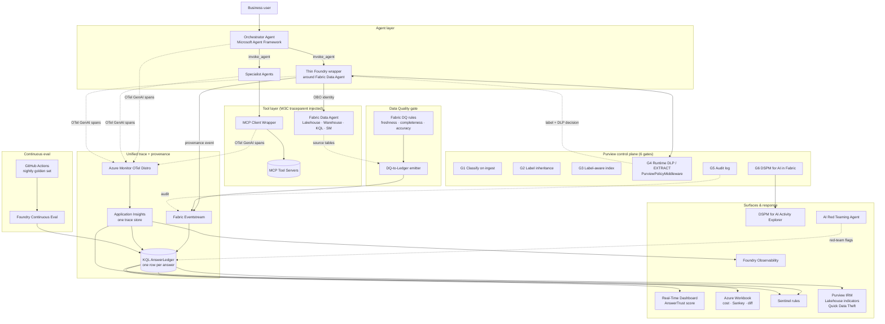

# 🛡️ MEGA — **AnswerTrust for Fabric**
### Governed, Quality-Gated, Observable, Auditable Agent Answers on Microsoft Fabric + Foundry + Purview

> A single flagship that fuses **provenance + continuous eval**, **OTel + MCP tracing**, a **unified trace fabric**, and a **Purview 6-gate control plane** — **and closes the fourth pillar: Fabric Data Quality**. One trace ID. One ledger. One trust score per answer.

---

## 1. Problem statement

Enterprises adopting **Fabric Data Agents + Foundry agents + MCP tools** hit a *trust collapse* that the existing Microsoft stack only solves in fragments. When a business user asks *"what was Q1 claims loss in Texas?"* and gets an answer, **nobody can answer the next five questions in under an hour**:

1. **Is the answer correct?** — no continuous eval of groundedness / intent / tool-call accuracy against a golden set.
2. **Was the underlying data fit for use?** — Fabric **Data Quality rules** run in Fabric, but their pass/fail state is **not joined to the agent's answer**. An agent can confidently answer over Bronze-grade or stale data and nobody knows.
3. **Was the user even allowed to see those rows?** — Purview **sensitivity labels**, **DLP Restrict Access** (now GA for Lakehouses, Warehouses, SQL DBs, KQL DBs across OneLake), and **EXTRACT rights** exist, but agents rarely enforce them at inference time.
4. **What exactly happened?** — generated SQL/KQL, source tables, rows touched, model, tokens, cost, agent handoffs, MCP tool args — scattered across Fabric, Foundry, App Insights, Purview Audit, with no shared trace ID.
5. **Is this getting worse?** — schema drift, prompt regressions, oversharing, prompt-injection — surfaced too late, in different tools (DSPM for AI, Insider Risk Mgmt, Sentinel, Foundry Observability).

The Microsoft platform has **every primitive needed** — Purview DSPM for AI in Fabric, DLP Restrict Access for OneLake structured data, sensitivity labels via public Fabric APIs, IRM Lakehouse indicators + Quick Data Theft policy, Foundry Continuous Eval, Agent Framework OTel GenAI conventions, Fabric Data Quality, AI Red Teaming Agent. **What is absent is the connective tissue** that makes them all hang off **one answer**.

> **The gap, stated precisely:** there is no single artifact today that says *"this answer, from this agent, for this user, was grounded on these rows, with these labels, that passed these DQ rules, scored this on groundedness, cost this much, and tripped these security signals."*

---

## 2. Scope

### 2.1 In scope (what we build in 4–6 weeks)

| # | Pillar | What gets built | Microsoft tech |
|---|---|---|---|
| **P1** | **Governance gates + Label-Suggestion Agent** | 6 Purview gates inline: auto-classification → label inheritance → label-aware indexing → runtime DLP/EXTRACT → audit → DSPM monitoring. Identity passthrough (OBO) end-to-end. **Bootstrap labeling** with a Fabric Data Agent that inspects each workspace item (Lakehouse, SQLEndpoint, Warehouse, KQL DB, SM) and *recommends* a sensitivity label (External / Confidential / Strictly Confidential) — one-click apply via the Fabric public **`Bulk Set Labels`** API. | Purview Data Map, Sensitivity Labels (Fabric public APIs: `List/Get/Create/Update Item`, `Bulk Set/Remove Labels`), DLP for OneLake, DSPM for AI in Fabric, Purview SDK middleware |
| **P2** | **Data Quality gate** | Every agent answer carries the **DQ posture** of its source tables: rule pass-rate, freshness lag, completeness, last-scan time. Answers from failing-DQ tables get a **trust penalty** and an optional **block / warn** policy. **DQ engine:** user picks Lakehouse → Tables → Columns → DQ Dimensions (Completeness · Uniqueness · Validity · Consistency · Timeliness) → Thresholds → the tool **generates and runs a Fabric notebook**, persists results to a `dq_runs` Lakehouse, and exposes per-table **Failed Rows** drill-down. Steward alerts fire when failed rows appear. | Fabric Data Quality + generated PySpark/Great-Expectations notebook, Lakehouse `dq_runs` store, OneLake table metadata, DQ-to-Ledger emitter |
| **P3** | **Unified trace fabric** | One Application Insights workspace; W3C `traceparent` propagated through orchestrator → specialist agents → MCP tool servers → Fabric Data Agent → generated SQL/KQL. Foundry Observability connected. | Microsoft Agent Framework, Azure Monitor OTel Distro, OTel GenAI multi-agent semconv, MCP client wrapper |
| **P4** | **AnswerLedger** | KQL provenance store, one row per answer: `{trace_id, user, agent_id, prompt, generated_query, source_tables, sensitivity_labels, dlp_decision, dq_score, row_count, model, tokens, cost, eval_scores, red_team_flags, irm_signals}`. | Fabric Eventstream → KQL DB |
| **P5** | **Continuous eval + drift** | Golden-question harness from `data_agent_queries/`; nightly Foundry continuous evaluators (groundedness, intent-resolution, tool-call accuracy, retrieval F1); version-diff regression; canonical-answer drift alarm. | Foundry Continuous Eval, GitHub Actions / ADO |
| **P6** | **Trust dashboard + AnswerTrust score** | One Real-Time Dashboard with a composite **AnswerTrust score = f(eval, DQ, label-compliance, red-team, freshness)** per answer, per domain, per agent version. Cost-per-conversation, handoff Sankey, oversharing tile. | Real-Time Dashboard, Azure Workbook |
| **P7** | **Security overlay + Steward alerts** | AI Red Teaming Agent in CI; **Sentinel** rules for drift, anomalous tool-args, anomalous label access; **IRM Lakehouse indicators + Quick Data Theft** policy wired to the same trace IDs. **Data Steward alerts** (Teams / email / Sentinel ticket) when failed-rows appear in `dq_runs` or when an answer's `dq_score` crosses a threshold. | AI Red Teaming Agent, Sentinel, Purview IRM, DSPM for AI, Fabric Activator (Reflex) |
| **P8** | **Packaged as a Fabric workspace item** | The whole thing installs as **one Fabric item** ( `azd up` / one-click). On entry, the user sees workspace items + current labels + DQ health side-by-side, can deploy the Fabric Data Agent + mount Lakehouses with one button, run a DQ scan, and view the AnswerTrust dashboard. | Fabric workload SDK, Bicep / `azd`, Fabric public APIs |

### 2.2 Out of scope (explicit non-goals)

- Building new Purview, Fabric, or Foundry features — we **compose existing primitives**.
- Replacing Foundry Observability or Sentinel — we **feed them**.
- Cross-cloud agents (AWS Bedrock / GCP Vertex). Microsoft stack only.
- Production hardening for regulated tenants (private link / customer-managed keys) — captured as Week 5+ stretch.

### 2.3 Substrate (reused from this repo)

- `datasets/` (10 industries) + `data_agent_queries/` → golden-question seed.
- `fabriciq-nurse-doc-burden-usecase/` → KQL ledger + Eventstream + Real-Time Dashboard pattern to clone.
- `cross_industry_notebooks/agent_instructions/` → seed Foundry agent prompts.
- Healthcare or Insurance domain as the **primary demo vertical**.

---

## 3. Proposed solution

### 3.1 Core idea — *"Every answer is a governed, quality-gated, evaluable, auditable artifact."*

A single **AnswerTrust envelope** wraps every agent response. Each gate writes one structured event; all events share the OTel `trace_id`; all events land in the **AnswerLedger**; the **AnswerTrust score** is computed from the envelope; dashboards, Sentinel rules, IRM policies, and DSPM all consume the same source of truth.

### 3.2 Reference architecture

### 3.3 UX & deployment pattern

Two patterns shape the user-facing surface:

1. **"Governance as a Fabric workspace item."** AnswerTrust installs **into** Fabric as an item — on entry, the user sees a single pane with all workspace items (Lakehouses, SQLEndpoints, Warehouses, KQL DBs, Semantic Models), their **current sensitivity label**, and their **DQ health**. One button deploys the Fabric Data Agent + mounts the Lakehouses. Governance lives *next to the data*, not in a separate portal.
2. **"Generated-notebook DQ with Failed Rows drill-down."** The user picks a Lakehouse → Tables → Columns → DQ Dimensions → Thresholds. The tool **generates a Fabric notebook**, runs it on schedule, persists each run into a `dq_runs` Lakehouse, and renders:
   - **Quality trend** sparkline vs target.
   - **Overall score%** gauge.
   - **Pass-rate by dimension** (Completeness · Uniqueness · Validity · Consistency · Timeliness).
   - **Table health** bars with click-through to **Failed Rows** for each table.

These surfaces are wired into the rest of AnswerTrust:

| Surface | How it feeds the answer |
|---|---|
| Workspace-items pane | Current sensitivity label feeds `PurviewPolicyMiddleware` for runtime EXTRACT enforcement |
| Label-Suggestion Data Agent | One-click apply via `Bulk Set Labels` feeds Purview label inheritance |
| DQ engine `dq_runs` Lakehouse | Joined to every agent answer in the AnswerLedger via shared `table_id` + `run_id` |
| Failed Rows drill-down | A failed row on a source table **drops `dq_score`** in real time on any in-flight or future answer using that table → AnswerTrust gauge moves → Sentinel + IRM signals fire |
| Steward alerts | Same alert pipeline fires for **answer-level** drops (e.g. `AnswerTrust < 0.5` on a Strictly Confidential domain) → Teams + Sentinel incident |
| OTel `trace_id` carried everywhere | A steward can click from a failed-row alert → the offending agent prompt → the generated SQL/KQL → cost + red-team flags |

### 3.4 The AnswerTrust score (the headline artifact)

$$
\text{AnswerTrust} = w_e \cdot \text{Eval} + w_d \cdot \text{DQ} + w_l \cdot \text{LabelCompliance} + w_f \cdot \text{Freshness} - w_r \cdot \text{RedTeamFlags}
$$

- **Eval** — weighted Foundry evaluators (groundedness, intent, tool-call, retrieval F1).
- **DQ** — pass-rate of Fabric DQ rules on source tables at query time.
- **LabelCompliance** — 1.0 if all source rows' sensitivity labels were within the user's EXTRACT rights; 0 otherwise.
- **Freshness** — staleness of source tables vs. SLA.
- **RedTeamFlags** — count of AI Red Teaming or Sentinel hits on the trace.

A single number, per answer, per domain, per agent version — **the SLA the CTO can defend, the audit row the CISO can hand to a regulator.**

### 3.5 Solution modules

AnswerTrust is composed of seven modules. Each module is self-contained — it owns a clear input, a clear output, and one or two Microsoft primitives it binds to. Modules compose through the shared `trace_id` and the AnswerLedger; none of them is sequenced as a milestone.

| Module | Purpose | What it owns | Microsoft primitives bound |
|---|---|---|---|
| **M1 · Foundation & identity passthrough** | Establish the Foundry project, Fabric workspace, and Agent Framework skeleton (orchestrator + specialist) with OBO identity carried end-to-end so every downstream gate can act on the *user's* rights. | Project scaffolding, agent skeleton, OBO wiring, Bicep / `azd up` install. | Microsoft Agent Framework, Foundry, Fabric workspace, Entra OBO. |
| **M2 · Governance gates + Label-Suggestion Agent** | Bind Purview gates G1–G2 to Fabric items and bootstrap labels via a Fabric Data Agent that *recommends* a sensitivity label per item with one-click apply. | Workspace-items pane (items + current labels), Label-Suggestion Data Agent, label-inheritance verification. | Purview Data Map, Sensitivity Labels (Fabric public APIs: `List/Get/Create/Update Item`, `Bulk Set/Remove Labels`), auto-classification. |
| **M3 · Unified trace fabric (OTel + MCP)** | Propagate W3C `traceparent` across orchestrator → specialist → MCP tool servers → Fabric Data Agent → generated SQL/KQL so every answer has one trace ID. | MCP client wrapper, OTel GenAI spans, single App Insights workspace, Foundry Observability link. | Azure Monitor OTel Distro, OTel GenAI multi-agent semconv, MCP. |
| **M4 · AnswerLedger (provenance store)** | Persist one structured row per answer keyed by `trace_id` so dashboards, Sentinel, IRM, and DSPM all consume one source of truth. | Fabric Eventstream pipeline, KQL `AnswerLedger` schema, provenance emitters from the Foundry wrapper. | Fabric Eventstream → KQL DB. |
| **M5 · Data Quality gate** | Join the DQ posture of source tables to every answer. User picks Lakehouse → Tables → Columns → Dimensions (Completeness · Uniqueness · Validity · Consistency · Timeliness) → Thresholds; the tool generates and runs a Fabric notebook, persists per-run results, and exposes Failed Rows drill-down. | DQ engine UI, generated PySpark notebook, `dq_runs` Lakehouse, Failed-Rows drill-down, DQ-to-Ledger emitter joining `table_id` + `run_id`. | Fabric Data Quality, OneLake table metadata, Lakehouse. |
| **M6 · Runtime DLP + continuous eval + AnswerTrust score** | Enforce EXTRACT rights + DLP at inference time via `PurviewPolicyMiddleware`, run nightly Foundry evaluators against a golden set, and compute the composite AnswerTrust score per answer. | `PurviewPolicyMiddleware`, golden-question harness, AnswerTrust score function, Real-Time Dashboard score-gauge + table-health bars, cost/Sankey workbook. | DLP for OneLake, Foundry Continuous Eval, Real-Time Dashboard, Azure Workbook. |
| **M7 · Security overlay (Red Team + Sentinel + IRM + DSPM) + Steward alerts** | Overlay adversarial findings and oversharing signals on the same trace IDs; fire Data Steward alerts on Failed Rows or AnswerTrust drops. | AI Red Teaming Agent in CI, Sentinel rules (drift, anomalous tool-args, anomalous label access), IRM Lakehouse indicators + Quick Data Theft policy, DSPM oversharing tile, Activator/Teams alerts. | AI Red Teaming Agent, Sentinel, Purview IRM, DSPM for AI, Fabric Activator (Reflex). |

**Optional hardening modules (not required for the flagship demo).** *Entra Agent ID* so every agent is a distinct principal; *APIM AI Gateway* in front of MCP for rate-limit + content safety; private endpoints + customer-managed keys; second industry vertical.

### 3.6 5-minute demo storyboard

1. Business user: *"Show Q1 nursing-doc burden, cardiology vs ICU."*
2. Live trace: `execute_task` → `invoke_agent` → MCP `tool.call` → Fabric Data Agent → generated KQL — **one trace ID**.
3. Open the AnswerLedger row: prompt, KQL, source tables, sensitivity labels, **DQ pass-rate**, row count, model, cost, groundedness, AnswerTrust = 0.91.
4. Break a DQ rule on a source table → next answer's AnswerTrust drops to 0.42, dashboard turns amber, **Failed Rows drill-down** shows the offending records, **Data Steward alert** fires in Teams + Sentinel ticket, IRM signal recorded.
5. Push a schema change → overnight continuous eval → drift alarm on canonical question → trace → SQL diff → root cause in < 5 minutes.
6. Run AI Red Teaming live → prompt-injection attempt flagged → linked to the same trace and to DSPM for AI Activity Explorer.
7. Show same trace in **Foundry Observability**, Workbook cost tile, DSPM oversharing tile — **one source of truth, four lenses.**

### 3.7 Audience-tuned value

- **CTO / Data leader** — Trust and cost become **SLAs**: AnswerTrust per domain, $/answer per agent version. The pilot-to-production blocker is removed.
- **Data platform team** — First end-to-end pattern for *Fabric Data Agent + multi-agent + MCP* observability + regression testing + DQ-linked answers, fully native.
- **CISO / Compliance** — Every answer is a forensic record: identity, prompt, generated query, rows, labels, DLP decision, DQ posture, red-team flag, IRM signal — **the artifact regulators will ask for.**

### 3.8 Success metrics (end of week 4)

| Metric | Target |
|---|---|
| Trace coverage | 100% orchestrator → specialist → MCP → Fabric in one App Insights workspace |
| Provenance coverage | 100% of Fabric Data Agent answers in AnswerLedger |
| DQ coverage | 100% of answers carry source-table DQ pass-rate + freshness |
| Label compliance enforced | 100% of answers gated by `PurviewPolicyMiddleware` |
| Eval coverage | ≥ 30 golden questions, 4 evaluators, nightly |
| MTTD drift | < 24h (eval) / < 5 min (Sentinel) |
| MTTR wrong-answer incident | < 10 min from alert to root cause via trace |

---

## 4. Why this wins

Point solutions exist for each capability today, but none of them produce **one auditable artifact per answer**. AnswerTrust closes that gap by composing five capability pillars under a single trace ID and a single score.

| Capability pillar | Status quo on the Microsoft stack | What AnswerTrust adds |
|---|---|---|
| **Provenance + continuous eval** | Available for Fabric Data Agents in isolation | Joined to multi-agent / MCP traces, runtime DLP decisions, and the DQ posture of source tables |
| **OTel + MCP trace propagation** | Available via Agent Framework + Azure Monitor OTel Distro | Extended with a data-layer provenance event and label/DQ context on every span |
| **Unified trace + ledger + security overlay** | Achievable by stitching Foundry Observability + App Insights + Sentinel by hand | Productized as one KQL `AnswerLedger` row + one Real-Time Dashboard + Sentinel/IRM rules pre-wired |
| **Purview 6-gate control plane** | Gates exist (classify, label, index, DLP, audit, DSPM) but are not bound to agent answers | Each gate emits a structured event keyed by the answer's `trace_id`, enforced inline by `PurviewPolicyMiddleware` |
| **Fabric Data Quality** | DQ rules run in Fabric but the pass/fail state is not joined to the answer | Generated-notebook DQ engine writes to `dq_runs`; every answer carries the DQ score of its source tables; failed rows drop AnswerTrust in real time |
| **Fabric-item UX + label-suggestion Data Agent** | Possible via the Fabric workload SDK + public sensitivity-label APIs | Packaged as one workspace item: items + labels + DQ health side-by-side, one-click `Bulk Set Labels`, one-button Fabric Data Agent deploy |

**AnswerTrust = Governance (Purview gates) × Quality (Fabric DQ) × Observability (OTel + MCP) × Evaluation (Foundry CE) × Security (Red Team + Sentinel + IRM + DSPM) — collapsed into one ledger row and one number per answer.**
